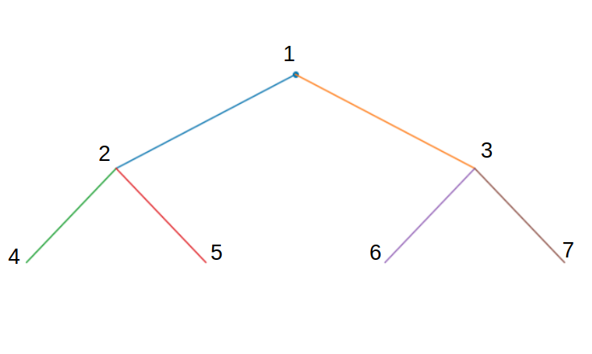

# PYFractals
[](https://mybinder.org/v2/gh/brettrhenderson/pyFractals/master?filepath=Sierpinski_Triangle.ipynb)
<p align="center">
    
</p>

This was just a fun Jupyter Notebook that I played around with while
procrastinating on my chemistry research. While trying to find a video of when
Professor Oliver Knill created a [Miley Cyrus Wrecking Ball animation](https://www.thecrimson.com/flyby/article/2013/10/9/the-cyrus-infection-miley-crashes-math-21a/)
in Mathematica to show some friends, I stumbled across his Mathematics in Movies
page on his website, and his quick nod to [Annihilation](http://people.math.harvard.edu/~knill/various/annihilation/index.html)
and the iterated function system-like animation during the end credits. This sent
me down a rabbit hole of finding fractal-generating software, and I figured I would
try to generate some rudimentary fractals of my own in the language I know best:
Python!

I vaguely remembered this awesome
[Doodling in Math Class](https://www.youtube.com/watch?v=e4MSN6IImpI&list=PLF7CBA45AEBAD18B8)
video on binary trees that I had seen back in high school and thought that would be
cool thing to implement in code.

## The Sierpiński triangle
As mentioned in the Doodling in Math Class video, drawing a binary tree with
consistent horizontal and vertical spacing for branches, and in which the branches
that meet have no children, is one method of constructing the [Sierpiński triangle](https://en.wikipedia.org/wiki/Sierpi%C5%84ski_triangle).
The Wikipedia page also details some other pretty cool constructions and is worth
a look!  Using the binary tree construction, however, adds the cool element of
practicing and *animating!* some basic tree traversal algorithms.

## Accessing the Notebook
### On Your laptop
First, set up a virtual environment to run the notebook. I have tested this Notebook
using python 3.7, but it will *probably* work with 3.5 or newer.

**Using virtualenv and pip**
I have frozen my working environment in [full_env.txt](full_env.txt), so the environment
can be recreated with

```pip install -r full_env.txt```

in your virtualenv to get the necessary dependencies. The weird name for the requirements
is to avoid conflicts with building the notebook environment on [Binder](#on-binder).
In order to display animations in the notebook, however, you will also need to
make sure that [ffmpeg](https://ffmpeg.org/download.html) is installed on your machine.

**Using conda**  
Alternatively, `environment.yml` can be used to create a conda environment that includes
ffmpeg. This is used for building the notebook on [Binder](#on-binder). If you
are a conda user, then, just run

```conda env create -f environment.yml```

Now you can explore the notebook by running

```jupyter notebook```

and then clicking on Sierpinski_Triangle.ipynb in the navigator.

### On Binder
As mentioned earlier, a fully interactive version of the [notebook](https://mybinder.org/v2/gh/brettrhenderson/pyFractals/master?filepath=Sierpinski_Triangle.ipynb)
is also available on Binder. Binder builds a Docker container containing a
conda environment with all of the dependencies and allows you to run and change
the notebook interactively without needing to install anything on your own machine!

## Some Examples
### Create a tree

```python
root = Node([0, 0])  # creates a node at the origin
root.left = Node([-1, -1], parent=root)  # Add children
root.right = Node([1, -1], parent=root)   
```

### Display the Tree

```python
fig = plt.figure(figsize=(6,6))  # set up the figure
ax = fig.add_subplot(111)
for node in bfs(root):           # traverse and draw the tree
    node.draw()
plt.axis('off')
plt.axis('equal')
plt.show()
```

This should display the following simple tree:


### Create Tree with Integer Values

Nodes need not strictly have values of Cartesian coordinates, but as of now, this
is the only way to plot them.  Here is an example, though, where the nodes have
numerical values, and the tree can still be searched and values printed in a
specified order. Specifying the parents of these nodes is not necessary, since
parents are only used in plotting the tree.

We will build the following tree, where the text shows the values associated with
each node.



```python
root = Node(1)  # creates a node at the origin
l1 = Node(2)  # Add children
r1 = Node(3)   
ll2 = Node(4)
lr2 = Node(5)
rl2 = Node(6)
rr2 = Node(7)
root.left, root.right = l1, r1
l1.left, l1.right = ll2, lr2
r1.left, r1.right = rl2, rr2

vals = []
for node in bfs(root):
    vals.append(node.val)
print(vals)
```

```
>>> [1, 2, 3, 4, 5, 6, 7]
```

Changing `bfs` above to another search algorithm will alter the order in which
node values are printed.

### Build a Sierpinski Triangle

To build the special Sierpinski tree, instantiate an object of type **Tree** and
then add some levels, or layers, to it.

```python
fig = plt.figure(figsize=(6,6))  # set up the figure
ax = fig.add_subplot(111)
tree = Tree(Node([0,0]), dx=1, dy=1, ax=ax)  # dx and dy determine branch dimensions
tree.add_layers(3, plot=True)   # grow the tree
plt.axis('off')
plt.axis('equal')
plt.show()
```

This should output


### Animate the Drawing of a Tree

So far this is only implemented for the actual **Tree** class and not for arbitrary
binary trees.

```python
from IPython.display import HTML

tree = Tree(Node([0,0]), dx=1, dy=1)  # initiate a tree with an origin at 0,0
tree.add_layers(15)  # grow the tree by adding 15 layers
anim = animate_sierpinsky(tree, order=dfs, N=3, interval=20, save_count=10**4)  # animate the drawing

HTML(anim.to_html5_video())  # display the video in notebook
```
